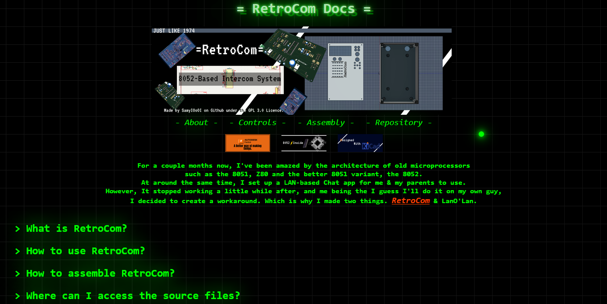

<h1 align='center'>= RetroCom Docs =</h1>

## 
FAQ-Style Documentation for [RetroCom](https://github.com/SamyIOoOI/RetroCom) A Hardware Project of mine.

Made with basic HTML, CSS, and Java Script.

The website covers common questions such as what RetroCom is, how to use it, how to assemble it & where to access the source files of RetroCom.

----------------------------
## 
Main Features

- Drop-down menus for each section, triggered by stripped down buttons emitating headers & hidden text.
- Green dot cursor with glowing effects.
- Animated neon style heading. (my second favourite part after the cursor)
- Contact information for bug reporting & Credits in the bottom.

## Licence

Made by SamyIOoOI on github under the GPL-3.0 Licence.

-----------------
Ignore how I named the repository... Didn't know that .github.io in the end wasn't required to host on github
